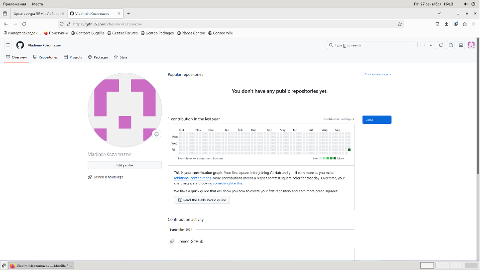
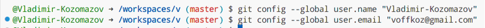
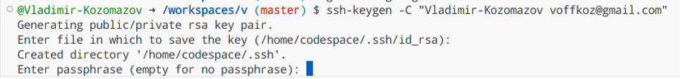
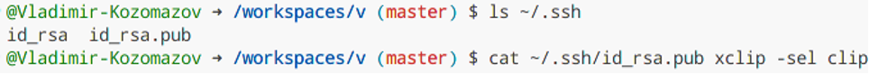
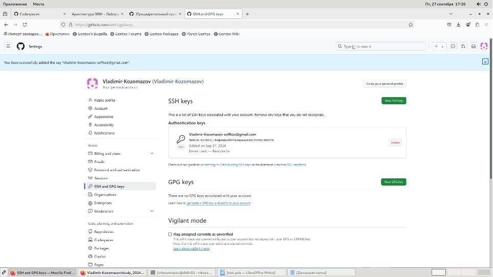
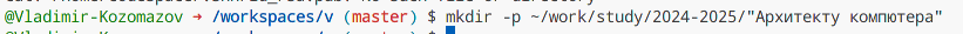
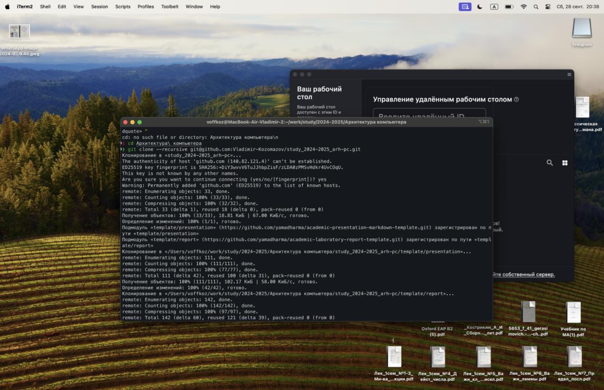
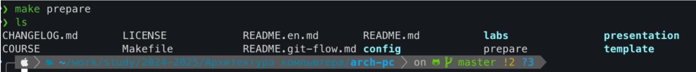
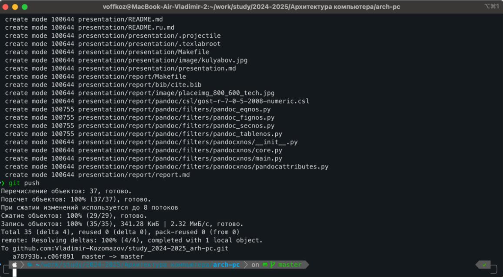

---
## Front matter
title: "Отчет по лабороатороной работе №2"
subtitle: "Отчет в формате Markdown"
author: "Владимир Романович Козомазов"

## Generic otions
lang: ru-RU
toc-title: "Содержание"

## Bibliography
bibliography: bib/cite.bib
csl: pandoc/csl/gost-r-7-0-5-2008-numeric.csl

## Pdf output format
toc: true # Table of contents
toc-depth: 2
lof: true # List of figures
lot: true # List of tables
fontsize: 12pt
linestretch: 1.5
papersize: a4
documentclass: scrreprt
## I18n polyglossia
polyglossia-lang:
  name: russian
  options:
	- spelling=modern
	- babelshorthands=true
polyglossia-otherlangs:
  name: english
## I18n babel
babel-lang: russian
babel-otherlangs: english
## Fonts
mainfont: IBM Plex Serif
romanfont: IBM Plex Serif
sansfont: IBM Plex Sans
monofont: IBM Plex Mono
#mathfont: STIX Two Math
mainfontoptions: Ligatures=Common,Ligatures=TeX,Scale=0.94
romanfontoptions: Ligatures=Common,Ligatures=TeX,Scale=0.94
sansfontoptions: Ligatures=Common,Ligatures=TeX,Scale=MatchLowercase,Scale=0.94
monofontoptions: Scale=MatchLowercase,Scale=0.94,FakeStretch=0.9
mathfontoptions:
## Biblatex
biblatex: true
biblio-style: "gost-numeric"
biblatexoptions:
  - parentracker=true
  - backend=biber
  - hyperref=auto
  - language=auto
  - autolang=other*
  - citestyle=gost-numeric
## Pandoc-crossref LaTeX customization
figureTitle: "Рис."
tableTitle: "Таблица"
listingTitle: "Листинг"
lofTitle: "Список иллюстраций"
lotTitle: "Список таблиц"
lolTitle: "Листинги"
## Misc options
indent: true
header-includes:
  # - \usepackage{indentfirst}
  # - \usepackage{float} # keep figures where there are in the text
  # - \floatplacement{figure}{H} # keep figures where there are in the text
---

# Цель работы

Данная работа предоставляет возможность получения практических навыков при работа с системой Git. Будут изучены основные принципы контроля версии, а также получен практический опыт работы с инструментами Git.

# Задание

Лабораторная работа подразумевает выполнение настройки и работы с системой контроля версий Git. Для начала создадим учётную запись на сайте https://github.com/ После этого сделаем предварительную конфигурацию git и сгенерируем пару ключей. Затем перейдём в каталог курса и создадим необходимые каталоги и отправим их на сервер.

# Теоретическое введение

# Выполнение лабораторной работы

## Настройка github
Создайте учётную запись на сайте https://github.com/ и заполните основные данные:

Сначала сделаем предварительную конфигурацию git. Откроем терминал и введём
следующие команды, указав имя и email владельца репозитория:

Настроим utf-8 в выводе сообщений git:

Зададим имя начальной ветки (будем называть её master):

Параметр autocrlf:

Параметр safecrlf:

## Создание SSH ключа
Сгенерируем пару ключей для последующих идентификации пользователя:

Скопируем из локальной консоли ключ в буфер обмена:

Грузим открытую часть ключа на сайт:

## Создание рабочего пространства и репозитория курса на основе шаблона
Создание каталога для предмета “Архитектура компьютера”:

## Настройка каталога курса:

Подготовка структуры каталога в склонированном репозитории:

Отправка файлов со структурой каталогов на github:

# Выводы

В ходе выполнения лабораторной работы были освоены начальные навыки по работе с Git и GitHub. Было
произведено клонирование репозитория, внесены изменения, которые были отправлены на GitHub.

# Список литературы{.unnumbered}

::: {#refs}
:::
