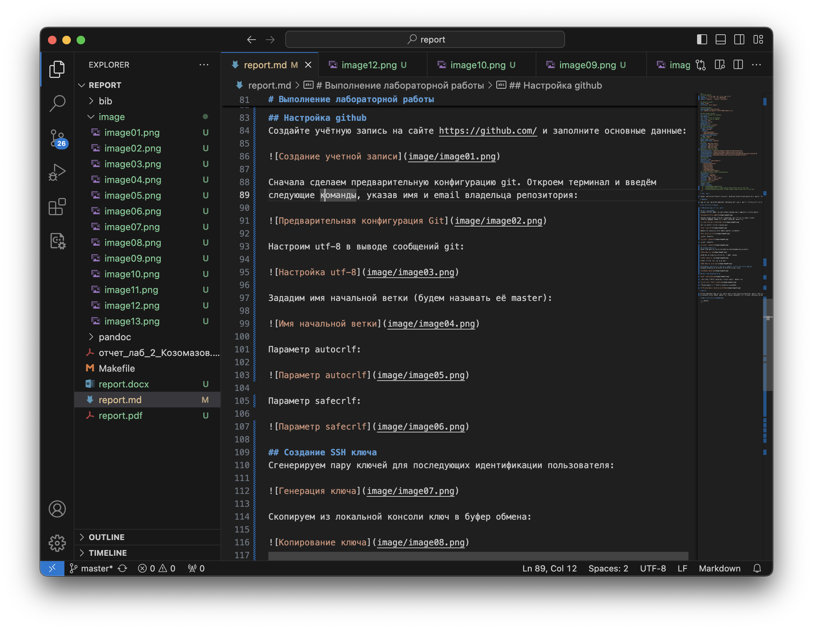

---
## Front matter
title: "Отчёт по лабораторной работе №3"
subtitle: "Простейший вариант"
author: "Козомазов Владимир Романович"

## Generic otions
lang: ru-RU
toc-title: "Содержание"

## Bibliography
bibliography: bib/cite.bib
csl: pandoc/csl/gost-r-7-0-5-2008-numeric.csl

## Pdf output format
toc: true # Table of contents
toc-depth: 2
lof: true # List of figures
lot: true # List of tables
fontsize: 12pt
linestretch: 1.5
papersize: a4
documentclass: scrreprt
## I18n polyglossia
polyglossia-lang:
  name: russian
  options:
	- spelling=modern
	- babelshorthands=true
polyglossia-otherlangs:
  name: english
## I18n babel
babel-lang: russian
babel-otherlangs: english
## Fonts
mainfont: IBM Plex Serif
romanfont: IBM Plex Serif
sansfont: IBM Plex Sans
monofont: IBM Plex Mono
mathfont: STIX Two Math
mainfontoptions: Ligatures=Common,Ligatures=TeX,Scale=0.94
romanfontoptions: Ligatures=Common,Ligatures=TeX,Scale=0.94
sansfontoptions: Ligatures=Common,Ligatures=TeX,Scale=MatchLowercase,Scale=0.94
monofontoptions: Scale=MatchLowercase,Scale=0.94,FakeStretch=0.9
mathfontoptions:
## Biblatex
biblatex: true
biblio-style: "gost-numeric"
biblatexoptions:
  - parentracker=true
  - backend=biber
  - hyperref=auto
  - language=auto
  - autolang=other*
  - citestyle=gost-numeric
## Pandoc-crossref LaTeX customization
figureTitle: "Рис."
tableTitle: "Таблица"
listingTitle: "Листинг"
lofTitle: "Список иллюстраций"
lotTitle: "Список таблиц"
lolTitle: "Листинги"
## Misc options
indent: true
header-includes:
  - \usepackage{indentfirst}
  - \usepackage{float} # keep figures where there are in the text
  - \floatplacement{figure}{H} # keep figures where there are in the text
---

# Цель работы

Цель работы является ознакомление с языком форматирования Markdown оформление лабораторной работы №2 на этом языке.

# Задание

Оформить отчёт по лабораторной работе №2 в формате Markdown и выложить на GitHub.

# Теоретическое введение

Язык Markdown - это язык разметки текстов на подобии HTML, только гораздо более легковестный, тоесть он использует болшее простой и понятный набор правил оформления текстов. 

Сейчас язык Markdown широко применяется для оформления различных текстов, таких как пояснительные записки, документация к программам, сообщениия в различных месенджерах. Также Markdown широко используется для написания документации на GitHub.

# Выполнение лабораторной работы
Для выполенния лаьбораторной работы небоходимо открыть файл `report.md` в редакторе и перенести туда отчет по лабораторной работе №2.

Далее в файл ` report.md` перенес содержимое лабороаторной работы №2:

После того, как все было готово, файлы были отправлены в репозиторий на GitHub.

# Выводы
Язык разметки Markdown является мощным инструментом оформления различных текстов, с которм, тем не менее, удобно и просто работать.

# Список литературы{.unnumbered}

1. [Статья в Википедии](https://ru.wikipedia.org/wiki/Markdown)
1. [Руководство на GitHub по оформлению Markdown файлов](https://gist.github.com/Jekins/2bf2d0638163f1294637)
1. [Полное руководство Markdown для начинающих](https://ru.markdown.net.br/)
