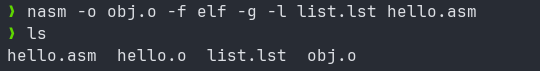

---
## Front matter
title: "Создание и процесс обработки программ на языке ассемблера NASM"
subtitle: "Лабораторная работа №4"
author: "Владимир Романович Козомазов"

## Generic otions
lang: ru-RU
toc-title: "Содержание"

## Bibliography
bibliography: bib/cite.bib
csl: pandoc/csl/gost-r-7-0-5-2008-numeric.csl

## Pdf output format
toc: true # Table of contents
toc-depth: 2
lof: true # List of figures
lot: true # List of tables
fontsize: 12pt
linestretch: 1.5
papersize: a4
documentclass: scrreprt
## I18n polyglossia
polyglossia-lang:
  name: russian
  options:
	- spelling=modern
	- babelshorthands=true
polyglossia-otherlangs:
  name: english
## I18n babel
babel-lang: russian
babel-otherlangs: english
## Fonts
mainfont: IBM Plex Serif
romanfont: IBM Plex Serif
sansfont: IBM Plex Sans
monofont: IBM Plex Mono
# mathfont: STIX Two Math
mainfontoptions: Ligatures=Common,Ligatures=TeX,Scale=0.94
romanfontoptions: Ligatures=Common,Ligatures=TeX,Scale=0.94
sansfontoptions: Ligatures=Common,Ligatures=TeX,Scale=MatchLowercase,Scale=0.94
monofontoptions: Scale=MatchLowercase,Scale=0.94,FakeStretch=0.9
mathfontoptions:
## Biblatex
biblatex: true
biblio-style: "gost-numeric"
biblatexoptions:
  - parentracker=true
  - backend=biber
  - hyperref=auto
  - language=auto
  - autolang=other*
  - citestyle=gost-numeric
## Pandoc-crossref LaTeX customization
figureTitle: "Рис."
tableTitle: "Таблица"
listingTitle: "Листинг"
lofTitle: "Список иллюстраций"
lotTitle: "Список таблиц"
lolTitle: "Листинги"
## Misc options
indent: true
header-includes:
  - \usepackage{indentfirst}
  - \usepackage{float} # keep figures where there are in the text
  - \floatplacement{figure}{H} # keep figures where there are in the text
---

# Цель работы

  * Краткое знакомство с устройством и основыми принципами работы компьютера.
  * Получение начальных сведений об архитектуре x86.
  * Знакомство с языком макроассемблера NASM, изучение и использоваие процесса трансляции и сборки программ, написанных на этом языке.

# Задание

Здесь приводится описание задания в соответствии с рекомендациями
методического пособия и выданным вариантом.

# Теоретическое введение

__Netwide Assembler__, или __NASM__ - это оидн из наиболее популярных ассемблеров под архитектуру Intel x86-64, поэтому знакомство с ним дает наиболее общее
представление о средствах разработки и написания программ на ассемблере под архитектуру x86.

Изучение языка ассемблера помогает лучше понять архитектуру компьютера и, соответственно, писать более эффективные по скорости и потреблению ресурсов
программы.

Артихектура Intel x86-64 является одной из главных архитектур для таких устройств как персональные компьютеры, ноутбуки и серверы. Архитектура Intel x86-64
обычно классифицируется как архитектура фон Неймана: это вычислительная машина, которая содержит три главных узла: центральный процессор, память и
и устройства ввода-вывода. Эти узлы связаны между собой с помощью системной шины, через которую они обмениваются между собой данными.

# Выполнение лабораторной работы

## Написание программы `Hello World!`
Создаю каталог для работы с программами на языке ассемблера NASM:

Перехожу в созданный каталог:

Создаю текстовый файл с именем `hello.asm` и открываю его в редакторе `nvim`:

Пишу программу:

Компилирую программу и в результате получаю объектный файл `hello.o`:

Компилирую программу с использованием расширенного синтаксиса командной строки NASM и проверяю, что все файлы были успешно созданы:

С помощью компоновщика `ld` из объектного файла `hello.o` получаю исполняемый файл `hello`:

Запускаю полученный исполняемый файл на выполнение:

# Выполнение самостоятельной работы

В каталоге `~/work/arch-pc/lab04` создаю копию файла `hello.asm` с именем `lab4.asm`:

Вношу изменения в файл `lab4.asm` согласно заданию:

Выполняю трансляцию и компоновку программы `lab4.asm`:

# Выводы

Здесь кратко описываются итоги проделанной работы.

# Список литературы{.unnumbered}

::: {#refs}
:::
