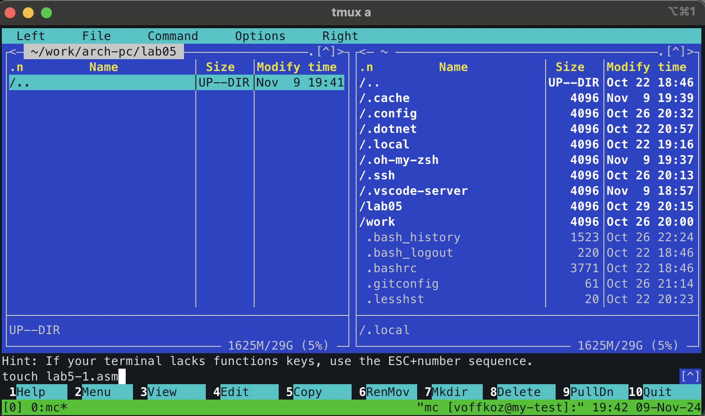

---
## Front matter
title: "Основы рвботы с _Midnight Commander_ (mc). Структура программы на языке ассемблера NASM. Системные вызовы в ОС GNU Linux"
subtitle: "Лабораторная работа №5"
author: "Владимир Романович Козомазов"

## Generic otions
lang: ru-RU
toc-title: "Содержание"

## Bibliography
bibliography: bib/cite.bib
csl: pandoc/csl/gost-r-7-0-5-2008-numeric.csl

## Pdf output format
toc: true # Table of contents
toc-depth: 2
lof: true # List of figures
lot: true # List of tables
fontsize: 12pt
linestretch: 1.5
papersize: a4
documentclass: scrreprt
## I18n polyglossia
polyglossia-lang:
  name: russian
  options:
	- spelling=modern
	- babelshorthands=true
polyglossia-otherlangs:
  name: english
## I18n babel
babel-lang: russian
babel-otherlangs: english
## Fonts
mainfont: IBM Plex Serif
romanfont: IBM Plex Serif
sansfont: IBM Plex Sans
monofont: IBM Plex Mono
# mathfont: STIX Two Math
mainfontoptions: Ligatures=Common,Ligatures=TeX,Scale=0.94
romanfontoptions: Ligatures=Common,Ligatures=TeX,Scale=0.94
sansfontoptions: Ligatures=Common,Ligatures=TeX,Scale=MatchLowercase,Scale=0.94
monofontoptions: Scale=MatchLowercase,Scale=0.94,FakeStretch=0.9
mathfontoptions:
## Biblatex
biblatex: true
biblio-style: "gost-numeric"
biblatexoptions:
  - parentracker=true
  - backend=biber
  - hyperref=auto
  - language=auto
  - autolang=other*
  - citestyle=gost-numeric
## Pandoc-crossref LaTeX customization
figureTitle: "Рис."
tableTitle: "Таблица"
listingTitle: "Листинг"
lofTitle: "Список иллюстраций"
lotTitle: "Список таблиц"
lolTitle: "Листинги"
## Misc options
indent: true
header-includes:
  - \usepackage{indentfirst}
  - \usepackage{float} # keep figures where there are in the text
  - \floatplacement{figure}{H} # keep figures where there are in the text
---

# Цель работы

  * Продолжение изучения работы в файловом менеджере Midnight Commander, освоение основных принципов работы на практике.
  * Продолждение изучения языка ассемблера NASM, знакомство с системными вызовами операционной системы. 


# Выполнение лабораторной работы

## Описание выполняемого задания
С помощью редактора `mcedit`, входящего в состав Midnight Commander, написать программу, состоящую из нескольких файлов, на языке ассемблера NASM, а также в самом MC поработать с файлами.

## Выполнение заданий лабораторной работы
1. Открыл Midnight Commander (рис. [-@fig:01])
{#fig:01}
1. Перешел в каталог `~/work/arch-pc`
1. С помощью функциональной клавишы `F7` создал директорию `lab05` и перешел в нее (рис. [-@fig:02])
{#fig:02}
1. С помощью команды `touch lab5-1.asm`, создал файл `lab5-1.asm` (рис. [-@fig:03])
{#fig:03}
1. Открыл созданный файл для редактирования и ввёл текст программф из листинга 5.1 (рис. [-@fig:04])
{#fig:04}
1. Оттранслировал созданый файл и, получив объектный файл, собрал его в исполняемый. Выполнил получившийся исполняемый файл(рис. [-@fig:05])
{#fig:05}
1. Скачал файл `in_out.asm` со страницы курса в ТУИС и поместил в ту же директорию, где лежит файл `lab5-1.asm`. 
1. С помощью Midnight Commander созадал копию файла `lab5-1.asm` и сохранил его под именем `lab5-2.asm` (рис. [-@fig:06])
{#fig:06}
1. Открыл файл `lab5-2.asm` и исправил его текст с использование подпрограмм из файла `in_out.asm` в соответствии с листингом 5.2 (рис. [-@fig:07]). Создал исполнямый файл и выполнил его.
{#fig:07}
1. В файле `lab5-2.asm` заменил вызов подпрограммы `sprintLF` на `sprint`, создал исполняемый файл и проверил его работу. Разница между вызовом `sprintLF` и `sprint` состоит в том, что в первом случае происходит переход на новую строку, а во втором случае - нет (рис. [-@fig:08])
{#fig:08}

## Выводы по результатам выполнения заданий
В ходе выполнения заданий лабораторной работы мной был использован файловый менеджер Midnight Commander и текстовый редактор nano. С помощью фалового менеджера создавались копии файлов, а в тектовом редакторе изменялся код программ. Также с помощью ассемблера NASM и компоновщика `ld` были произведены трансляция и получение исполняемых файлов созданных программ. Была выявлена разница между вызовом функций `sprintLF` и `sprint`.

# Выполнение самостоятельного задания

## Описание выполняемого самостоятельного задания
Необходимо создать копии файлов `lab5-1.asm` и `lab5-2.asm` и внести в них изменения так, чтобы они работали в соответствии с приведённым в пункте 5.4 задания алгоритмом.

## Выполнение заданий для самостоятельной работы
1. Создаю копий файлов `lab5-1.asm` и `lab5-2.asm` (рис. [-@fig:09])
{#fig:09}
1. Вношу изменения в файл `lab5-1-copy.asm`, чтобы полученная программа работала в соответсвии с алгоритмом в задании (рис. [-@fig:10])
{#fig:10}
1. Получаю исполняемый файл и проверяю его работоспособность (рис. [-@fig:11])
{#fig:11}
1. Вношу изменения в файл `lab5-1-copy.asm`, чтобы полученная программа работала в соответсвии с алгоритмом в задании (рис. [-@fig:12])
{#fig:12}
1. Получаю исполняемый файл и проверяю его работоспособность (рис. [-@fig:13])
{#fig:13}

## Выводы по результатам выполнения самостоятельного задания
В ходе выполнения задания для самостоятельной работы было произведено изменение файлов, полученных при выполнении лабораторной работы, таким образом, чтобы программы, полученные в результате их трансляции и сборки, изменили своё поведение в соответсвии с заданием. После успешной проверки работоспособности полученных исполняемых файлов, можно сделать вывод о том, что задание для самостоятельной работы выполнено.

## Листинги написанных программ

Лстинг программы `lab5-1-copy.asm`:
```asm
; lab5-1-copy.asm

SECTION .data
  msg:    DB 'Введите строку',10
  msgLen: EQU $-msg

SECTION .bss
  buf1:     RESB 80

SECTION .text
  GLOBAL _start

_start:
  mov eax,4
  mov ebx,1
  mov ecx,msg
  mov edx,msgLen
  int 80h

  mov eax,3
  mov ebx,0
  mov ecx,buf1
  mov edx,80
  int 80h

  mov eax,4
  mov ebx,1
  mov ecx,buf1
  mov edx,80
  int 80h

  mov eax,1
  mov ebx,0
  int 80
```

Листинг программы `lab5-2-copy.asm`:
```asm
; lab5-2-copy.asm

%include 'in_out.asm'

SECTION .data
  msg:    DB "Введите строку: ",0h

SECTION .bss
  buf1:     RESB 80

SECTION .text
  GLOBAL _start

_start:
  mov eax,msg
  call sprint

  mov ecx,buf1
  mov edx,80
  call sread

  mov eax,buf1
  call sprintLF

  call quit
```

# Выводы
В ходе выполнения лабораторной работы №5 удалось достичь всех поставленных целей, а именно:
* Удалось продолжить изучение файлового менеджера Midnight Commander, освоить методы создания и редактирования файлов на практике;
* Удалось продолжить изучение языка ассемблера NASM, поработать с подпрограммами и вызовом подпрограмм из собственной программы.