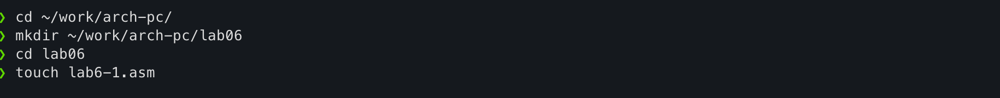
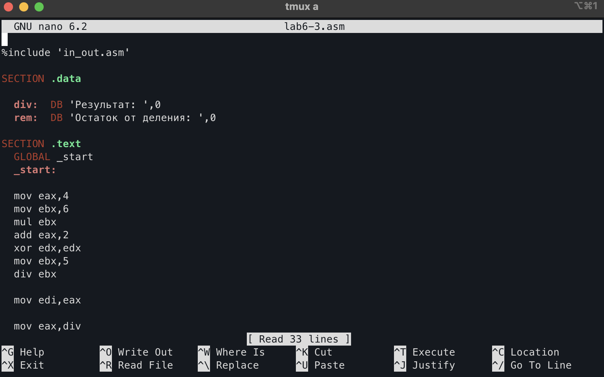

---
## Front matter
title: "Арифметические операции в NASM"
subtitle: "Лабораторная работа №6"
author: "Владимир Романович Козомазов"

## Generic otions
lang: ru-RU
toc-title: "Содержание"

## Bibliography
bibliography: bib/cite.bib
csl: pandoc/csl/gost-r-7-0-5-2008-numeric.csl

## Pdf output format
toc: true # Table of contents
toc-depth: 2
lof: true # List of figures
lot: true # List of tables
fontsize: 12pt
linestretch: 1.5
papersize: a4
documentclass: scrreprt
## I18n polyglossia
polyglossia-lang:
  name: russian
  options:
	- spelling=modern
	- babelshorthands=true
polyglossia-otherlangs:
  name: english
## I18n babel
babel-lang: russian
babel-otherlangs: english
## Fonts
mainfont: IBM Plex Serif
romanfont: IBM Plex Serif
sansfont: IBM Plex Sans
monofont: IBM Plex Mono
# mathfont: STIX Two Math
mainfontoptions: Ligatures=Common,Ligatures=TeX,Scale=0.94
romanfontoptions: Ligatures=Common,Ligatures=TeX,Scale=0.94
sansfontoptions: Ligatures=Common,Ligatures=TeX,Scale=MatchLowercase,Scale=0.94
monofontoptions: Scale=MatchLowercase,Scale=0.94,FakeStretch=0.9
mathfontoptions:
## Biblatex
biblatex: true
biblio-style: "gost-numeric"
biblatexoptions:
  - parentracker=true
  - backend=biber
  - hyperref=auto
  - language=auto
  - autolang=other*
  - citestyle=gost-numeric
## Pandoc-crossref LaTeX customization
figureTitle: "Рис."
tableTitle: "Таблица"
listingTitle: "Листинг"
lofTitle: "Список иллюстраций"
lotTitle: "Список таблиц"
lolTitle: "Листинги"
## Misc options
indent: true
header-includes:
  - \usepackage{indentfirst}
  - \usepackage{float} # keep figures where there are in the text
  - \floatplacement{figure}{H} # keep figures where there are in the text
---

# Цель работы

  * Изучить работу с численными и символьными данными в языке ассемблера NASM.

  * Изучить арифметические операции в языке ассемблера NASM и поработать с ними на практике.


# Выполнение лабораторной работы

## Описание выполняемого задания

  * Написать программы для работы с численными и символьными данными и выводом их на экран.
  * Написать программы для работы с арифметическими операциями и вычисления значения арифметического выражения.

## Выполнение заданий лабораторной работы 

### Символьные и численые данные в NASM

  Создал каталог для программ лабораторной работы №6, перешёл в него и создал файл `lab6-1.asm` (рис. [-@fig:01])

  {#fig:01}

  Ввёл в файл `lab6-1.asm` текст программыы из листинга 6.1 (рис. [-@fig:02])

  {#fig:02}

  Создал исполняемы файл и запустил его (рис. [-@fig:03])

  {#fig:03}

  Изменил текст программы, вместо символов подставил числа (рис. [-@fig:04])

  {#fig:04}

  Повторно создал исполняемый файл и запустил его (рис. [-@fig:05]). В результате выполнения програмы на экран вывелась пустая строка, что говорит о том, что на экран вывелся символ с кодом 10 - `LF`.

  {#fig:05}

  Создал файл `lab6-2.asm` и ввёл в него код из листинга 6.2 (рис. [-@fig:06])

  {#fig:06}

  Аналогично предыдущему примеру изменил текст программы `lab6-2.asm`, заменив символы на числа (рис. [-@fig:07])

  {#fig:07}

  Повторно скомпилировал и запустил програму `lab6-2` (рис. [-@fig:08]). В результате получили, как и ожидалось, число 10

  {#fig:08}

  Заменил функцию `iprintLF` на `iprint` (рис. [-@fig:09])

  {#fig:09}

  Повторно скомпилировал и запустил програму `lab6-2` (рис. [-@fig:10]). Вывод программы отличается тем, что после её выполнения не происходит переход на новую строку.

  {#fig:10}

### Выполнение арифметических операций в NASM

  Создал файл `lab6-3.asm` и ввёл в него код из листинга 6.3 (рис. [-@fig:11])

  {#fig:11}

  Скомпилировал и запустил программу `lab6-3` (рис. [-@fig:12])

  {#fig:12}

  Изменил текст файла `lab6-3.asm` так, чтобы он вычислял значение выражения (4 * 6 + 2)/5 (рис. [-@fig:13])

  {#fig:13}
  
  Повторно скомпилировал и запустил программу `lab6-3` (рис. [-@fig:14])
  
  {#fig:14}

  Для написания программы вычисления варианта задания по номеру студенческого билета создал файл `variant.asm` и ввёл в него код из листинга 6.4 (рис. [-@fig:15])

  {#fig:15}

  Скомпилировал и запустил программу `variant` (рис. [-@fig:16])

  {#fig:16}

### Ответы на вопросы по заданию:
  
  1. За вывод на экран сообщения "Ваш вариант: " отвечают следующие строки:

     ```asm
     mov eax,rem
     call sprint
     ```  
  
  1. Инструкции

     ```asm
     mov ecx,x
     mov edx,80
     call sread
     ```

     используются для запроса у пользователя данных, которые он вводит с клавиатуры и сохранения их в переменную `x`.
  
  1. Инструкция `call atoi` используется для преобразования значения, которое ввёл пользователь с клавиатуры из строки в число, с которыми можно производить арифметические операции.
  
  1. За вычисление варианта отвечают следующие строки:
     
     ```asm
     xor edx,edx
     mov ebx,20
     div ebx
     inc edx
     ```
  
  1. Остаток от деления при выполнении инструкции `div ebx` записывается в регистр `edx`.
  1. Инструкция `inc edx` используется для того, чтобы увеличить остаток от деления на единицу.
  1. За вывод на экран результата вычислений отвечают следующие строки:

     ```asm
     mov eax,rem
     call sprint
     mov eax,edx
     call iprintLF
     ```


## Выводы по результатам выполнения заданий
В ходе выполнения заданий лабораторной работы были созданы программы для сложения символов и чисел и вывода их на экран. Была продемонстрирована разница между работой с символами и числами, а также были исользованы различные функции для вывода их на экран, в частности такие функции, как `iprint`, `iprintLF` и `atoi`. Была продемонстрирована разница между выводом функций `iprintLF` и `iprint`: вывод функция `iprint` отличается от функции `iprintLF` тем, что после её выполнения не происходит переход на новую строку.

Также в ходе выполнения лабораторной работы был преобретён навык вычисления арифметических выражений, а также освоен метод деления с остатком, который очень часто используется в программировании.

# Выполнение самостоятельного задания

## Описание выполняемого самостоятельного задания
Написать программу для вычисления выражения $y = f(x)$. Программа должна выводить выражения для вычисления, выводить запрос на ввод значения $х$, вычислять заданное выражение в зависимости от введённого $x$, выводить результат вычислений.

## Выполнение заданий для самостоятельной работы
Создал файл `calc_function.asm` и написал код для выполнения задания (рис. [-@fig:17])

{#fig:17}

Проверка программы `calc_function` на правильность вычислений (рис. [-@fig:18])

{#fig:18}

## Выводы по результатам выполнения самостоятельного задания
В ходе выполнения задания для самостоятельной работы была разработана программа для вычисления значения заданной функции $f(x)$ при различный значения $x$. При написании программы были применены методы и техники, освоенные в ходе выполнения лабораторной работы, в частности метод обработки ввода пользователя, выводы сообщений на экран и вычисление математических выражений.

## Листинги написанных программ

Листинг программы `lab6-1.asm`
```asm
%include 'in_out.asm'

SECTION .bss
buf1:   RESB 80

SECTION .text
  GLOBAL _start
  _start:

  mov eax,6
  mov ebx,4
  add eax,ebx
  mov [buf1],eax
  mov eax,buf1
  call sprintLF

  call quit
```

Листинг программы `lab6-2.asm`
```asm
%include 'in_out.asm'

SECTION .text
  GLOBAL _start
  _start:

  mov eax,6
  mov ebx,4
  add eax,ebx
  call iprint

  call quit
```

Листинг программы `lab6-3.asm`
```asm
%include 'in_out.asm'

SECTION .data

  div:  DB 'Результат: ',0
  rem:  DB 'Остаток от деления: ',0

SECTION .text
  GLOBAL _start
  _start:

  mov eax,4
  mov ebx,6
  mul ebx
  add eax,2
  xor edx,edx
  mov ebx,5
  div ebx

  mov edi,eax

  mov eax,div
  call sprint
  mov eax,edi
  call iprintLF

  mov eax,rem
  call sprint
  mov eax,edx
  call iprintLF

  call quit
```

Листинг программы `variant.asm`
```asm
%include 'in_out.asm'

SECTION .data
  msg: DB 'Введите № студенческого билета: ',0
  rem: DB 'Ваш вариант: ',0

SECTION .bss
  x: RESB 80

SECTION .text
  GLOBAL _start
  _start:

  mov eax,msg
  call sprintLF

  mov ecx,x
  mov edx,80
  call sread

  mov eax,x
  call atoi

  xor edx,edx
  mov ebx,20
  div ebx
  inc edx

  mov eax,rem
  call sprint
  mov eax,edx
  call iprintLF

  call quit
```

Листинг программы `calc_function.asm`
```asm
%include 'in_out.asm'

SECTION .data
  msg:     DB 'Вычисление значения функции (8х + 6) * 10',0
  request: DB 'Введите значение х: ',0
  answer:  DB 'Результат: ',0

SECTION .bss
  x:       RESB 80 ; Значение, которое вводит пользователь
  buf1:    RESB 80 ; Промежуточная переменная для хранения результата вычислений

SECTION .text
  GLOBAL _start
  _start:

  ; Выводим пользователю выражение для вычисления
  mov eax,msg
  call sprintLF

  ; Выводими запрос на ввод значения с клавиатуры
  mov eax,request
  call sprint

  ; Организуем ввод данных с клавиатуры
  mov ecx,x
  mov edx,80
  call sread

  ; Преобразуем значение, введённое пользователем, в число
  mov eax,x
  call atoi

  ; Вычисляем выражение
  mov ebx,8
  mul ebx
  mov ebx,6
  add eax,ebx
  mov ebx,10
  mul ebx

  ; Сохраняем результат вычислений в переменную buf1
  mov [buf1],eax

  ; Выводим результат вычисления пользователю
  mov eax,answer
  call sprint
  mov eax,[buf1]
  call iprintLF

  call quit
```

# Выводы
В ходе выполнения лабораторной работы №6 удалось достичь всех поставленных целей, а именно:

* Была изучена работа с численными и символьными данными в языке ассемблера NASM, а также написаны программы для закрепления изученного материала, в частности было продемонстрированно различие в работе с символами и числами, а также использованы разные функции для вывода символов и чисел на экран.

* Была изучена работа с арифметическими операциями в зыке ассемблера NASM, были написаны программы для вычисления заданных арифметических выражений, были изучены такие команды как `mul`, `div`, `inc`, `dec`, `neg`, `add`, `sub`. 