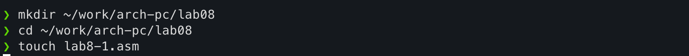
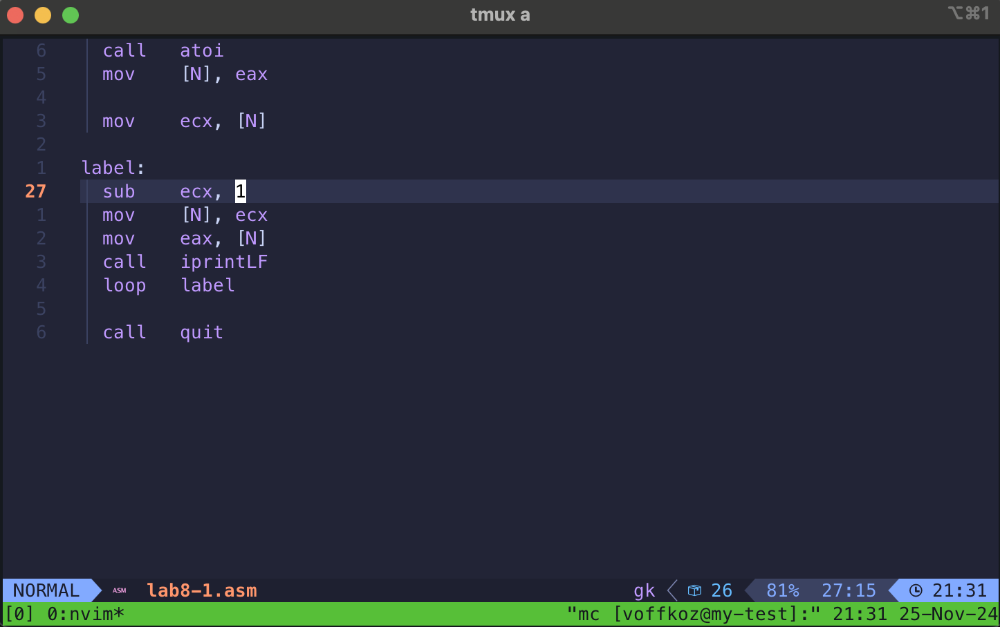
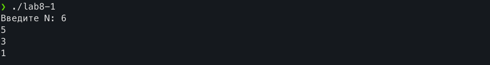
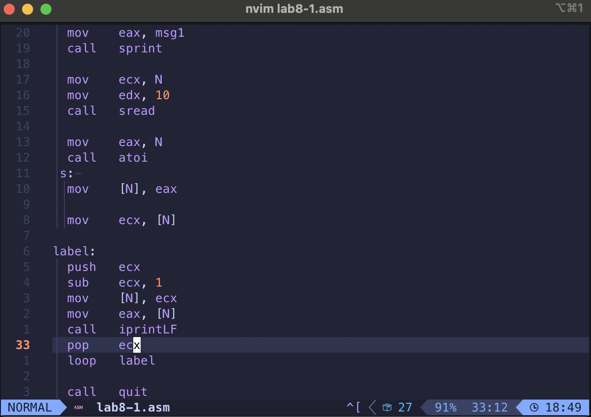
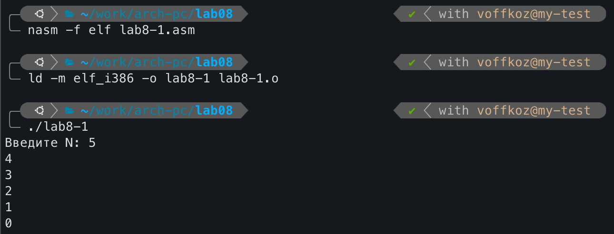

---
## Front matter
title: "Программирование цикла. Обработка аргументов командной строки"
subtitle: "Лабораторная работа №8"
author: "Владимир Романович Козомазов"

## Generic otions
lang: ru-RU
toc-title: "Содержание"

## Bibliography
bibliography: bib/cite.bib
csl: pandoc/csl/gost-r-7-0-5-2008-numeric.csl

## Pdf output format
toc: true # Table of contents
toc-depth: 2
lof: true # List of figures
lot: true # List of tables
fontsize: 12pt
linestretch: 1.5
papersize: a4
documentclass: scrreprt
## I18n polyglossia
polyglossia-lang:
  name: russian
  options:
	- spelling=modern
	- babelshorthands=true
polyglossia-otherlangs:
  name: english
## I18n babel
babel-lang: russian
babel-otherlangs: english
## Fonts
mainfont: IBM Plex Serif
romanfont: IBM Plex Serif
sansfont: IBM Plex Sans
monofont: IBM Plex Mono
# mathfont: STIX Two Math
mainfontoptions: Ligatures=Common,Ligatures=TeX,Scale=0.94
romanfontoptions: Ligatures=Common,Ligatures=TeX,Scale=0.94
sansfontoptions: Ligatures=Common,Ligatures=TeX,Scale=MatchLowercase,Scale=0.94
monofontoptions: Scale=MatchLowercase,Scale=0.94,FakeStretch=0.9
mathfontoptions:
## Biblatex
biblatex: true
biblio-style: "gost-numeric"
biblatexoptions:
  - parentracker=true
  - backend=biber
  - hyperref=auto
  - language=auto
  - autolang=other*
  - citestyle=gost-numeric
## Pandoc-crossref LaTeX customization
figureTitle: "Рис."
tableTitle: "Таблица"
listingTitle: "Листинг"
lofTitle: "Список иллюстраций"
lotTitle: "Список таблиц"
lolTitle: "Листинги"
## Misc options
indent: true
header-includes:
  - \usepackage{indentfirst}
  - \usepackage{float} # keep figures where there are in the text
  - \floatplacement{figure}{H} # keep figures where there are in the text
---

# Цель работы

  * Изучение циклов, преобретение навыков написания программ с использованием циклов.

  * Изучение методов обработки аргументов командной строки.

# Выполнение лабораторной работы

## Описание выполняемого задания
  
  * Написание программ дял работы с цциклами.
  
  * Написание программ для работы с аргументами командной строки.

## Выполнение заданий лабораторной работы 

### Реализация циклов в NASM
  
  Создал каталог для программ лабораторной работы №8 и перешёл в него. Создал файл `lab8-1.asm` 
  (рис. [-@fig:01])

  {#fig:01}

  В файл `lab8-1.asm` ввёл код из листинга 8.1 (рис. [-@fig:02])

  {#fig:02}

  Проверил программу `lab8-1.asm` на работоспособность (рис. [-@fig:03])

  {#fig:03}

  Изменил текст программы `lab8-1` (рис. [-@fig:04])

  {#fig:04}

  Скомпилировал и запустил программу (рис. [-@fig:05])

  {#fig:05}

  Программа в этом случае работает следующим образом: если мы введм с клавиатуры четное число, то прогармма выведет на экран только нечентные числа и остановится, напечатав `1`. А если введем четное число, то при достижении нуля произойдет переполнение разрядов и программа будет печатать все четные числа от $2^{32}$ до $0$.

  Регистр `ecx` в цикле принимает все значения от $N$ до $0$, но на печать выводятся значения через один, так как вычитание в цикле производится два раза.

  Число проходов цикла не соотвествует значению $N$, введённому с клавиатуры, так как уменьшение регистра `ecx` в цикле происходит два раза.

  Внёс изменения в текст программы для использования стека (рис. [-@fig:06])

  {#fig:06}

  Создал исполняемый файл и проверил его работу (рис. [-@fig:07])

  {#fig:07}

  В данном случае число проходов в цикле соответсвует значению $N$, введённому с клавиатуры., так как в начале цикла исходное значение регистра `ecx` мы кладём на стек, а в конце цикла мы его извлекаем из стека.

### Обработка аргументов командной строки
  
  Создал файл `lab8-2.asm` и ввёл в него код из листинга 8.2 (рис. [-@fig:08])

  {#fig:08}

  Скомпилировал и запустил программу `lab8-2.asm` (рис. [-@fig:09])

  {#fig:09}

  В ходе выполнения программы было обработано 4 аргумента командной строки, но при печати вывелось только 3, так как первый аргумент - это название программы и мы его обработали, но на печать не вывели.

  Создал файл `lab8-3.asm` и ввёл в него текст программы из листинга 8.3 (рис. [-@fig:10])

  {#fig:10}

  Скомпилировал и запустил программу `lab8-3.asm` (рис. [-@fig:11])

  {#fig:11} 

  Изменил текст программы для выисления произведения аргументов командной строки (рис. [-@fig:12])

  {#fig:12}

  Скомпилировал и запустил программу `lab8-3.asm` (рис. [-@fig:13])

  {#fig:13}


## Выводы по результатам выполнения заданий лабораторной работы
  
  В ходе выполнения заданий лабораторной работы были приобретены навыки по написанию программ с использованием циклов и обработкой аргументов командной строки. Были созданны программы с использованием циклических действий для вывода значений от $N$ до нуля, а также обработки аргументов командной строки и выполнения операций с ними. 

# Выполнение самостоятельного задания
  

## Описание выполняемого самостоятельного задания
  
  Написать программу, которая находит сумму значений $f(x)$ для разных значений $x$ и выводит результат на экран. Значения $x_i$ передаются как аргументы командной строки. Нужно создать исполняемый файл и проверить его рабюоту на нескольких наборах $x = x_1, x_2, \ldots,  x_n$.

## Выполнение задания для самостоятельной работы

  Создал файл `lab8-calc-function.asm` и ввёл в него код программы (рис. [-@fig:14])

  {#fig:14}

  Скомпилировал и запустил программу `lab8-calc-function` и проверил её работу на разных входных данных (рис. [-@fig:15])

  {#fig:15}

## Выводы по результатам выполнения самостоятельного задания
  
  В ходе выполнения задания для самостоятельной работы была создана программа, которая вычисляет сумму значений функции $f(x)$ при разных значениях $x$, получаемых из аргументов командной строки. Обработка аргументов командной строки выполняется в цикле.

# Выводы
  
  В ходе выполнения лабораторной работы №8 были изучены методы организации циклов в языке ассемблера NASM, приобретены навыки работы со стеком и написаны несколько программ с использованием циклов. Также были написаны программы, получающие входные данные из аргументов командной строки.


# Листинги написанных программ

## Программа `lab8-1.asm`

```asm
%include "in_out.asm"

SECTION .data
  msg1    db "Введите N: ", 0h

SECTION .bss
  N       resb 10

SECTION .text
  global _start

_start:
  mov    eax, msg1
  call   sprint

  mov    ecx, N
  mov    edx, 10
  call   sread

  mov    eax, N
  call   atoi
 s: 
  mov    [N], eax

  mov    ecx, [N]

label:
  push   ecx
  sub    ecx, 1
  mov    [N], ecx
  mov    eax, [N]
  call   iprintLF
  pop    ecx
  loop   label

  call   quit
```

## Программа `lab8-2.asm`

```asm
%include "in_out.asm"

section .text
  global _start
  
_start:
  pop    ecx
  pop    edx
  sub    ecx, 1

next:
  cmp    ecx, 0
  jz     _end

  pop    eax
  call   sprintLF
  loop   next

_end:
  call   quit
```

## Программа `lab8-3.asm`

```asm
%include "in_out.asm"

section .data
  msg    db "Результат: ", 0h

section .text
  global _start

_start:
  pop    ecx
  pop    edx
  sub    ecx, 1
  mov    esi, 1

next:
  cmp    ecx, 0
  jz     _end
  pop    eax
  call   atoi
  imul   esi, eax
  loop   next

_end:
  mov    eax, msg
  call   sprint
  mov    eax, esi
  call   iprintLF
  call   quit
```

## Программа `lab8-calc-function.asm`

```asm
%include "in_out.asm"

section .data
  msg1    db "Функция: f(x) = 12x - 7", 0h
  msg2    db "Результат: ", 0h

section .text
  global _start

_start:
  ; Обрабатываем аргументы командной строки
  pop    ecx
  pop    edx
  sub    ecx, 1
  mov    esi, 0

  ; Создаём цикл для вычисления значений функции f(x) при разных
  ; значениях х, получаемых из командной строки
next:
  cmp    ecx, 0
  jz     _end
  pop    eax
  call   atoi
  ; Вычисляем значение функции
  imul   eax, 12
  sub    eax, 7
  ; Увеличили сумматор на вычисленное значение функции
  add    esi, eax
  loop   next

_end:
  mov    eax, msg1
  call   sprintLF
  mov    eax, msg2
  call   sprint
  mov    eax, esi
  call   iprintLF
  call quit
```

