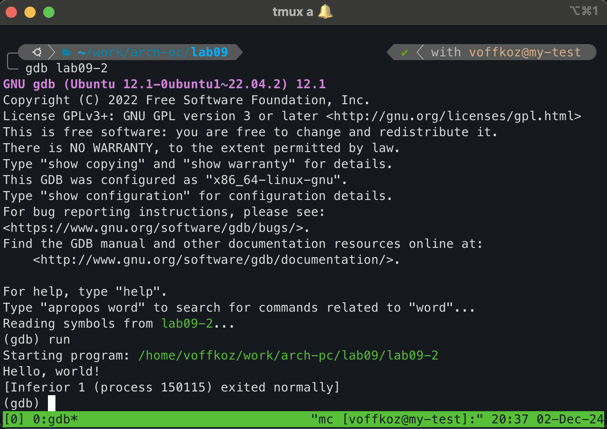
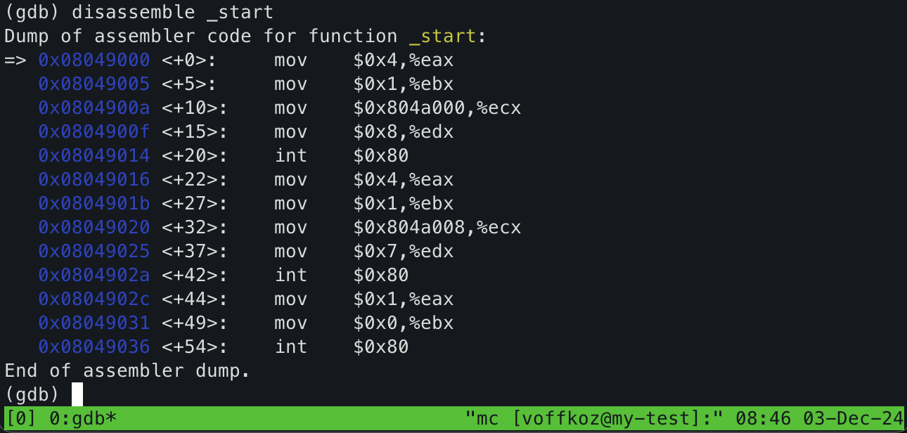
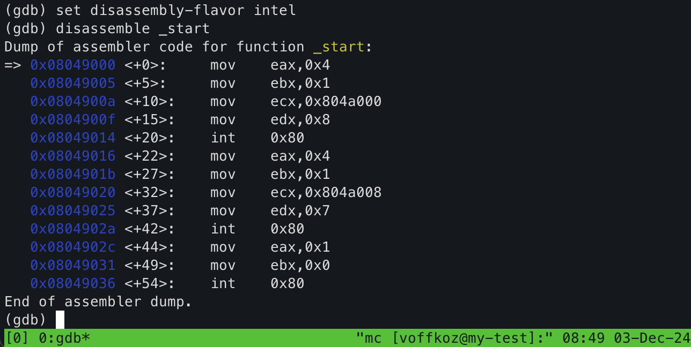
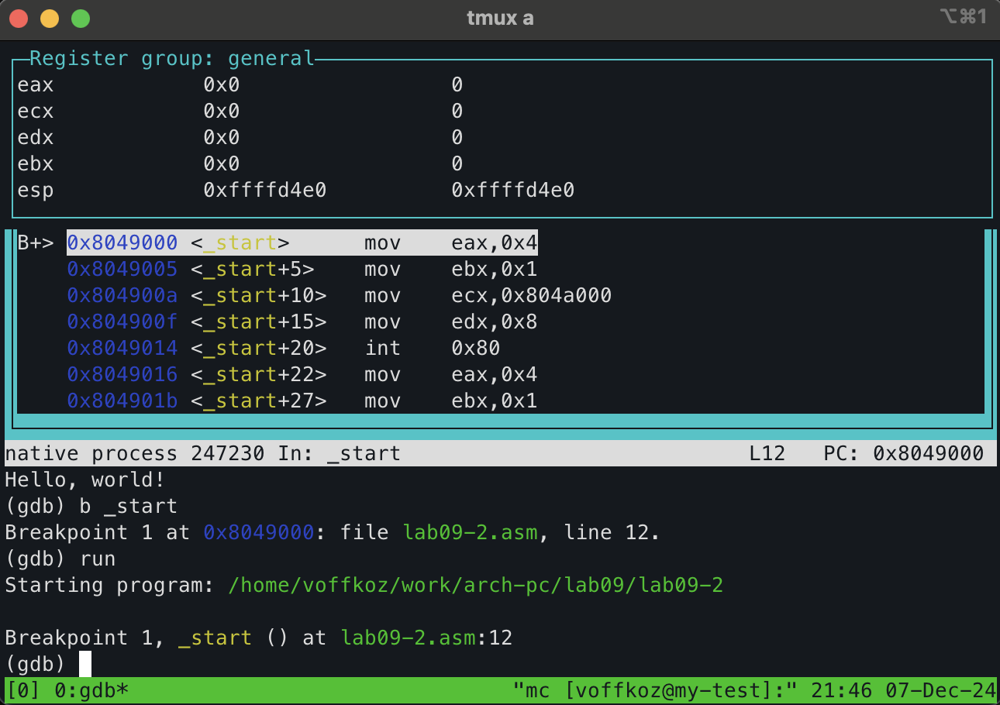
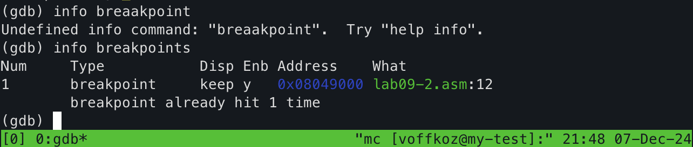
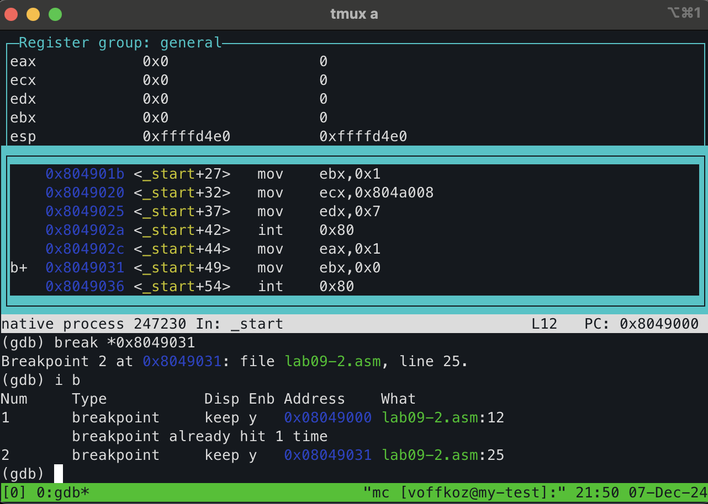
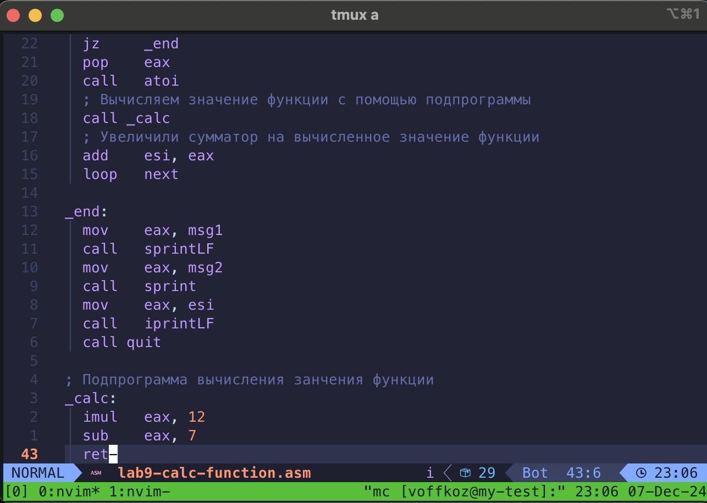

---
## Front matter
title: "Понятие подпрограммы. Отладчик GDB"
subtitle: "Лабораторная работа №9"
author: "Владимир Романович Козомазов"

## Generic otions
lang: ru-RU
toc-title: "Содержание"

## Bibliography
bibliography: bib/cite.bib
csl: pandoc/csl/gost-r-7-0-5-2008-numeric.csl

## Pdf output format
toc: true # Table of contents
toc-depth: 2
lof: true # List of figures
lot: true # List of tables
fontsize: 12pt
linestretch: 1.5
papersize: a4
documentclass: scrreprt
## I18n polyglossia
polyglossia-lang:
  name: russian
  options:
	- spelling=modern
	- babelshorthands=true
polyglossia-otherlangs:
  name: english
## I18n babel
babel-lang: russian
babel-otherlangs: english
## Fonts
mainfont: IBM Plex Serif
romanfont: IBM Plex Serif
sansfont: IBM Plex Sans
monofont: IBM Plex Mono
# mathfont: STIX Two Math
mainfontoptions: Ligatures=Common,Ligatures=TeX,Scale=0.94
romanfontoptions: Ligatures=Common,Ligatures=TeX,Scale=0.94
sansfontoptions: Ligatures=Common,Ligatures=TeX,Scale=MatchLowercase,Scale=0.94
monofontoptions: Scale=MatchLowercase,Scale=0.94,FakeStretch=0.9
mathfontoptions:
## Biblatex
biblatex: true
biblio-style: "gost-numeric"
biblatexoptions:
  - parentracker=true
  - backend=biber
  - hyperref=auto
  - language=auto
  - autolang=other*
  - citestyle=gost-numeric
## Pandoc-crossref LaTeX customization
figureTitle: "Рис."
tableTitle: "Таблица"
listingTitle: "Листинг"
lofTitle: "Список иллюстраций"
lotTitle: "Список таблиц"
lolTitle: "Листинги"
## Misc options
indent: true
header-includes:
  - \usepackage{indentfirst}
  - \usepackage{float} # keep figures where there are in the text
  - \floatplacement{figure}{H} # keep figures where there are in the text
---

# Цель работы

  * Изучение методов отладки при помощи GDB, знакомство с его основными возможностями.
  
  * Научиться писать программы с использованием подпрограмм.

# Выполнение лабораторной работы

## Описание выполняемого задания
  
  * Написание программ дял работы с цциклами.
  
  * Написание программ для работы с аргументами командной строки.

## Выполнение заданий лабораторной работы 

### Реализация подпрограмм в NASM
  
  Создал  каталог для выполнения лабораторной работы №9, создал в нём файл `lab09-1.asm` (рис. [-@fig:01])

  {#fig:01}

  Ввёл в файл `lab09-1.asm` текст программы из листинга 9.1 (рис. [-@fig:02])

  {#fig:02}

  Скомпилировал исполняемый файл `lab09-1.asm` и проверил его работу (рис. [-@fig:03])

  {#fig:03}

  Изменил текст программы `lab09-1`, добава подпрограмму `_subcalcul` (рис. [-@fig:04])

  {#fig:04}

  Скомпилировал файл `lab09-1.asm` с изменённым кодом и проверил его работу (рис. [-@fig:05])

  {#fig:05}

### Отладка программ с помощью GDB

  Создал файл `lab09-2.asm` и ввёл в него текст из листинга 9.2 (рис. [-@fig:06])

  {#fig:06}

  Получил исполняемый файл для отладки, добавив ключ `-g` (рис. [-@fig:07])

  {#fig:07}

  Запустил отладчик GDB, загрузил в него исполняенмый файл `lab09-2` и проверил работу программы в отладчике с помощью команды `run` (рис. [-@fig:08])

  {#fig:08}

  Установил точку останова на метку `_start` и запустил её (рис. [-@fig:09])

  {#fig:09}

  Посмотрел дисассимилированный код программы с метки `_start` (рис. [-@fig:10])

  {#fig:10}

  Переключился на отображение команд с Intel'овским синтаксисом при помощи команды `disassemble-flavor intel`. Заметил различия в синтаксисе. При режиме работы ATT сначала идёт источник, затем приёмник, а при режиме работы Intel порядок обратный. Также перед числовыми константами в ATT стоит знак `$`, в то время, как в Intel этого  знака нет. Перед регистрами стоит знак `%` в режме ATT, а в Intel такого знака нет. (рис. [-@fig:11])

  {#fig:11}

  Включил режим псевдографики для анализа программ (рис. [-@fig:12])

  {#fig:12}

  ### Добавление точек останова

  Проверил наличие точки останова с помощью команды `info breakpoint` (рис. [-@fig:13])

  {#fig:13}

  Установил точку останова по адресу инструкции с помощью команды `break *0x8049031` и посмотрел ифнормацию о всех точках останова (рис. [-@fig:14])

  {#fig:14}

  ### Работа с данными программы в GDB

  Выполнил 5 раз команду `si` и проследил за изменегиями значений регистров. Изменились значения регистров `eax`, `ebx`, `ecx`, `edx` (рис. [-@fig:15])

  {#fig:15}

  Посмотрел значение переменной `msg1` с помощью команды `x/1sb &msg1` (рис. [-@fig:16])

  {#fig:16}

  Просмотрел значение переменной `msg2` с помощью команды `x/1sb 0x804a008` (рис. [-@fig:17])

  {#fig:17}

  Заменил первый символ переменной `msg1` (рис. [-@fig:18])

  {#fig:18}

  Заменил первый символ переменной `msg2` (рис. [-@fig:19])

  {#fig:19}

  Вывел в различных форматах значение регистра `edx` (рис. [-@fig:20])

  {#fig:20}

  Изменил значение регистра `ebx` с помощью команды `set`. В первом случае при вводе команды `p/s $ebx` выводился код символа "2" в кодировке ASCII, во втором случае выводилось значение регистра `ebx`, там находилось число 2 (рис. [-@fig:21])

  {#fig:21}

  Завершил выполнение программы с помощью команды `c` и вышел из `GDB` с помощью команды `q`

  ### Обработка аргументов командной строки в GDB

  Скопировал файл `lab8-2.asm` в файл `lab09-3.asm` и создал исполняемый файл (рис. [-@fig:22])

  {#fig:22}

  Запустил программу с аргументами и проанализировал стек программы. (рис. [-@fig:23])

  {#fig:23}

  Размер шага равен 4, так как мы скомпилировали 32-битную программу, поэтому в стеке находятся 4-байтные данные.
  
# Выполнение самостоятельного задания

## Описание выполняемого самостоятельного задания
  
  * Преобразовать программу из лабораторной работы №8, реализовав вычисление значения функции $f(x)$ как подпрограмму.
  * С помощью отладчика GDB определить ошибку в приведённой программе и исправить её.

## Выполнение задания для самостоятельной работы

  Скопировал программу для вычисления значения функции из лабораторной работы №8 в файл `lab9-calc-function.asm`и реализовал вычисления значения функции $f(x)$ как подпрограмму (рис. [-@fig:24])

  {#fig:24}

  Создал исполняемый файл и запустил его (рис. [-@fig:25])

  {#fig:25}

  Написал код программы из листинга 9.3 в файл `lab9-error.asm`. Скомпилировал программу и убедился, что она выдаёт ошибочный результат (рис. [-@fig:26])

  {#fig:26}

  Запустил программу и при помощи отладчика нашёл ошибку (рис. [-@fig:27])

  {#fig:27}

  исправил ошибки в программе, скомпилировал её и проверил правильность работы (рис. [-@fig:28])

  {#fig:28}

## Выводы по результатам выполнения самостоятельного задания
  
  В результате выполнения самостоятельного задания была проведена работа с отладчиком GDB для поиска и исправления ошибок в программе. В результате в программе были найдены и исправлены ошибки.

# Выводы

  * В ходе выполнения лабораторной работы №9 была разобрана концепци подпрограмм в языке NASM, были приобретены навыки написания программ с использованием подпрограмм.
  * Познакомился с отладчиком GDB и приобрёл навыки отладки программы и поиска оишбок с его помощью.

# Листинги написанных программ

