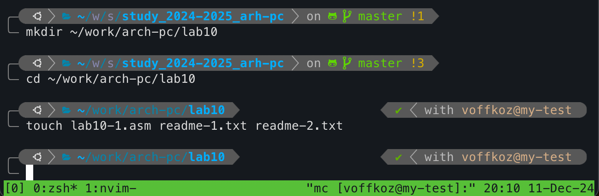
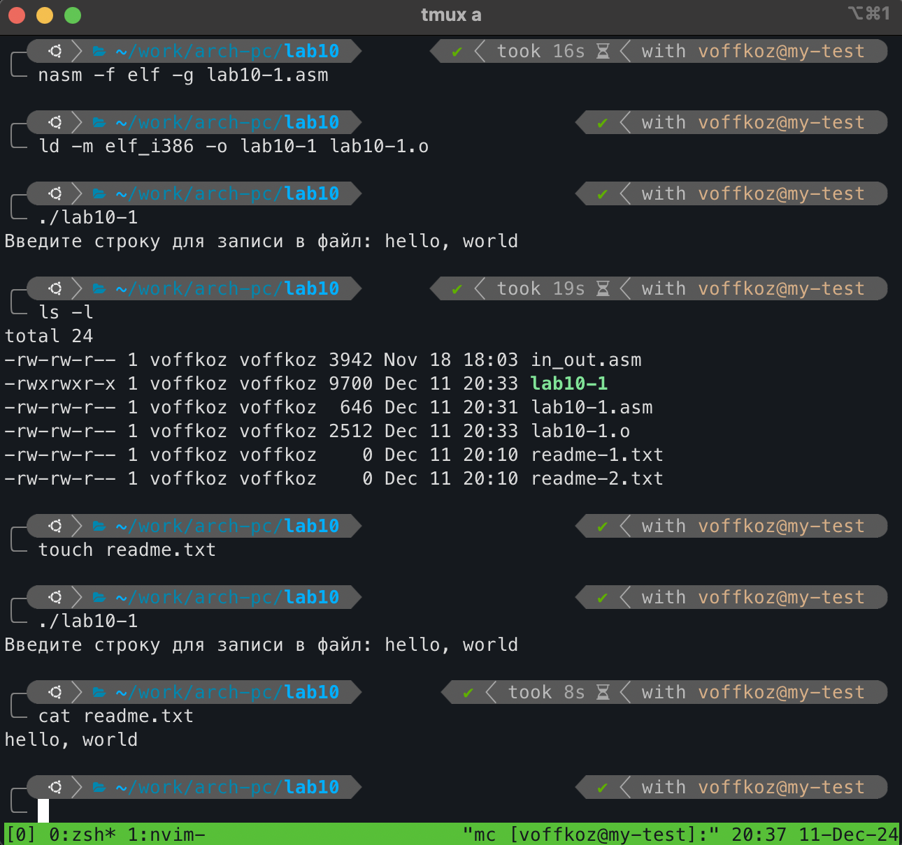
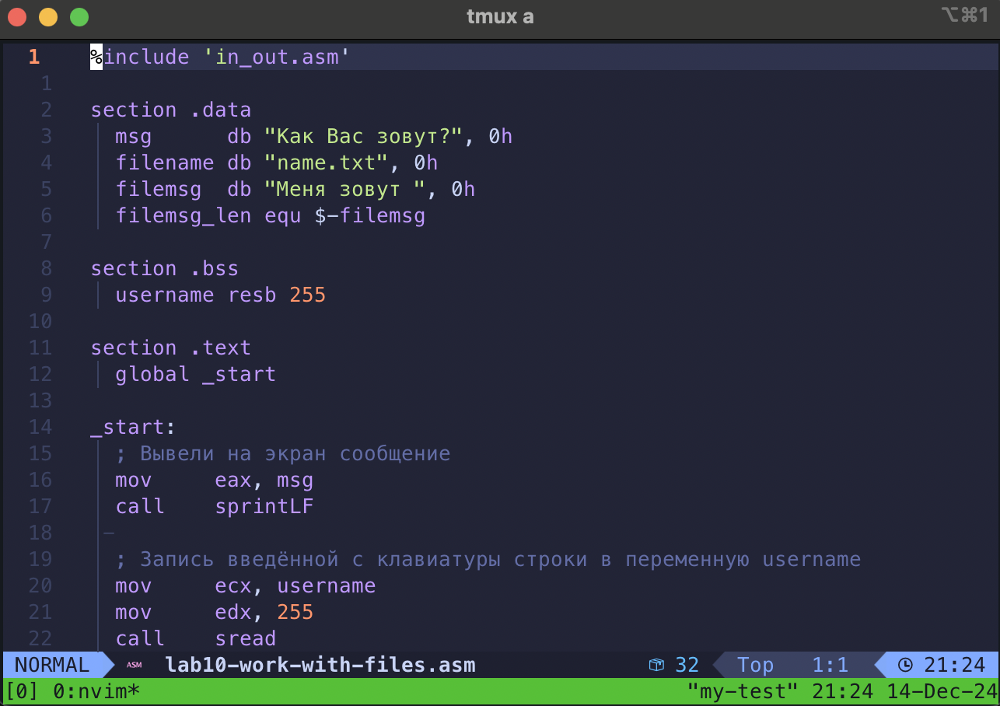
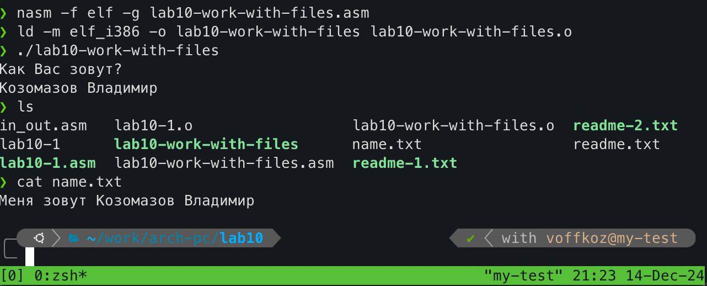

---
## Front matter
title: "Работа с файлами средствами NASM"
subtitle: "Лабораторная работа №10"
author: "Владимир Романович Козомазов"

## Generic otions
lang: ru-RU
toc-title: "Содержание"

## Bibliography
bibliography: bib/cite.bib
csl: pandoc/csl/gost-r-7-0-5-2008-numeric.csl

## Pdf output format
toc: true # Table of contents
toc-depth: 2
lof: true # List of figures
lot: true # List of tables
fontsize: 12pt
linestretch: 1.5
papersize: a4
documentclass: scrreprt
## I18n polyglossia
polyglossia-lang:
  name: russian
  options:
	- spelling=modern
	- babelshorthands=true
polyglossia-otherlangs:
  name: english
## I18n babel
babel-lang: russian
babel-otherlangs: english
## Fonts
mainfont: IBM Plex Serif
romanfont: IBM Plex Serif
sansfont: IBM Plex Sans
monofont: IBM Plex Mono
# mathfont: STIX Two Math
mainfontoptions: Ligatures=Common,Ligatures=TeX,Scale=0.94
romanfontoptions: Ligatures=Common,Ligatures=TeX,Scale=0.94
sansfontoptions: Ligatures=Common,Ligatures=TeX,Scale=MatchLowercase,Scale=0.94
monofontoptions: Scale=MatchLowercase,Scale=0.94,FakeStretch=0.9
mathfontoptions:
## Biblatex
biblatex: true
biblio-style: "gost-numeric"
biblatexoptions:
  - parentracker=true
  - backend=biber
  - hyperref=auto
  - language=auto
  - autolang=other*
  - citestyle=gost-numeric
## Pandoc-crossref LaTeX customization
figureTitle: "Рис."
tableTitle: "Таблица"
listingTitle: "Листинг"
lofTitle: "Список иллюстраций"
lotTitle: "Список таблиц"
lolTitle: "Листинги"
## Misc options
indent: true
header-includes:
  - \usepackage{indentfirst}
  - \usepackage{float} # keep figures where there are in the text
  - \floatplacement{figure}{H} # keep figures where there are in the text
---

# Цель работы

  * Освоить приниципы назначения прав доступа к файлу в системе  Linux
  * Освоить методы работы с файлами на языке ассемблера NASM.

# Выполнение лабораторной работы

## Описание выполняемого задания
  
  * Написать программу для записи файла сообщения.

  * С помощью команды `chmod` изменить права доступа к определённым файлам.

## Выполнение заданий лабораторной работы 
  
### Работа с файлами в языке NASM

  Создал каталог для программ лабораторной работы №10, переёшл в него и создал файлы `lab10-1.asm`, `readme-1.txt`, `readme-2.txt` (рис. [-@fig:01])

  {#fig:01}

  Ввёл в файл `lab10-1.asm` текст программы из листинга 10.1 (рис. [-@fig:02])

  {#fig:02}

  Создал исполняемый файл и проверил его работу (рис. [-@fig:03])

  {#fig:03}

### Работа с правами доступа к файлам
  
  Изменил права доступа к файлу `lab10-1`, запретив его выполнение, с помощью команды `chmod` и попробовал его запустить (рис. [-@fig:04]) 

  {#fig:04}

  При попытке запуска файла на исполнение, была выдана ошибка о нарушении прав доступа, так как прав на исполнение этого файла у нас больше нет.

  Изменил права доступа к файлу `lab10-1.asm`, добавив всем права на исполнение и попытался его выполнить (рис. [-@fig:05])

  {#fig:05}

  Такой результат выполнения мы получили, потомучто в файле находится программа на ассемблере, а не bash-скрипт

  В соответствии с вариантом из таблицы 10.4, предоставил права доступа к файлам `readme-1.txt` и `readme-2.txt` (рис. [-@fig:06])

  {#fig:06}

## Выводы по результатам выполнения лабораторной работы

  В ходе выполнения лабораторной работы была написана программа для записи в файл текста, получепнного из стандартного ввода. Также в ходе выполнения лабораторной работы были изучены варианты настройки прав доступа к файлам и способы их установки и изменения с помощью команды `chmod`.
  
# Выполнение самостоятельного задания

## Описание выполняемого самостоятельного задания
  
  * Написать программу для работы с файлами, которая работает по алгоритму из задания.

## Выполнение задания для самостоятельной работы

  Создал программу `lab10-work-with-files.asm` и ввёл в него код программы, работаующий по приведённому в задании алгоритму (рис. [-@fig:07])

  {#fig:07}

  Скомпилировал программу `lab10-work-with-files` и проверил правильность её работы (рис. [-@fig:08])

  {#fig:08}
 

## Выводы по результатам выполнения самостоятельного задания
  
  В результате выполнения самостоятельного задания была написана программа, запрашивающая у пользователя его фамимлию и имя, создающая файл и записываующая в него введённые пользователем фамимлию и имя. 

# Выводы

  * В ходе выполнения лабораторной работы №10 удалось освоить основные принципы назначения прав доступа к файлам в системе Linux.
  * Удалось освоить методы работы с файлами в языке ассеблера NASM, в частности, создание, открытие, запись и закрытие файла.

# Листинги написанных программ

